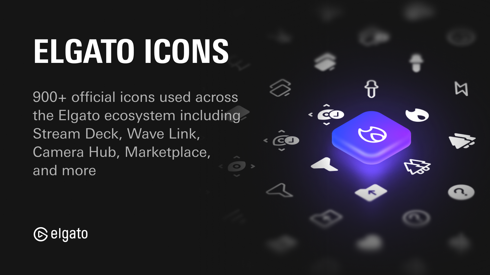

# Elgato Icons

<div align="center">

[](https://docs.elgato.com/icons)

[![Elgato homepage](https://img.shields.io/badge/Elgato-3431cf?labelColor=grey&logo=data:image/svg+xml;base64,PHN2ZyByb2xlPSJpbWciIHZpZXdCb3g9IjAgMCAyNCAyNCIgeG1sbnM9Imh0dHA6Ly93d3cudzMub3JnLzIwMDAvc3ZnIj48dGl0bGU+RWxnYXRvPC90aXRsZT48cGF0aCBmaWxsPSIjZmZmZmZmIiBkPSJtMTMuODgxOCA4LjM5NjQuMDI2MS4wMTk2IDkuOTQ5NCA1LjcxNzJjLS40ODg0IDIuNzI5LTEuOTE5NiA1LjIyMjMtNC4wMzg0IDcuMDI1M0ExMS45MjYyIDExLjkyNjIgMCAwIDEgMTIuMDk3IDI0Yy0zLjE5MjUgMC02LjE5MzktMS4yNDc3LTguNDUyNy0zLjUxNDRDMS4zODY4IDE4LjIxODguMTQyNyAxNS4yMDQ0LjE0MjcgMTJjMC0zLjIwNDIgMS4yNDQtNi4yMTg3IDMuNTAxNS04LjQ4NTRDNS45MDE5IDEuMjQ4IDguOTAzMiAwIDEyLjA5NyAwYzIuNDM5NCAwIDQuNzg0Ny43MzMzIDYuNzgzIDIuMTE4NyAxLjk1MjYgMS4zNTQgMy40NDY2IDMuMjM1NyA0LjMyMjcgNS40NDIyLjExMTIuMjgyOS4yMTQ5LjU3MzYuMzA1MS44NjU3bC0yLjEyNTUgMS4yMzU5YTkuNDkyNCA5LjQ5MjQgMCAwIDAtLjI2MTktLjg2OTRjLTEuMzU0LTMuODMwMy00Ljk4MTMtNi40MDQ4LTkuMDIzNy02LjQwNDhDNi44MTcxIDIuMzg4MyAyLjUyMiA2LjcwMDUgMi41MjIgMTJjMCA1LjI5OTUgNC4yOTUgOS42MTE1IDkuNTc0OCA5LjYxMTUgMi4wNTIgMCA0LjAwODQtLjY0NDIgNS42NTk2LTEuODY0NyAxLjYxNzItMS4xOTU1IDIuODAzNi0yLjgzMzcgMy40MzA5LTQuNzM2NGwuMDA2NS0uMDQxOUw5LjU5MDYgOC4zMDQ4djcuMjI1Nmw0LjAwMDQtMi4zMTM4IDIuMDYgMS4xODExLTUuOTk2MiAzLjQ2ODgtMi4xMi0xLjIxMjZWNy4xOTQzbDIuMTE3NC0xLjIyNDUgNC4yMzA5IDIuNDI3OS0uMDAxMy0uMDAxMyIvPjwvc3ZnPg==)](https://elgato.com)
[](https://discord.gg/GehBUcu627)
[](https://github.com/elgatosf/icons/actions)

</div>

Discover icons used throughout the Elgato ecosystem, commonly found in Stream Deck, Wave Link, Camera Hub, Capture, and Marketplace. Mix, match, and curate your own icon packs based on our design language.

## Usage

```bash
npm install @elgato/icons
```

### JavaScript Variables

Icons can be imported as SVG strings from `@elgato/icons/{s,m,l}`, for example:

```ts
import { iconLogoElgato } from "@elgato/icons/m";

iconLogoElgato; // SVG string of the Elgato logo, medium (m) size.
```

All icons are available in medium (m), with some also available in small (s) and large (l).

-   `@elgato/icons/s` — optimized for 16 × 16 px.
-   `@elgato/icons/m` — optimized for 20 × 20 px.
-   `@elgato/icons/l` — optimized for 24 × 24 px.

### React Components

Icons can be imported as React components from `@elgato/icons/react`, for example:

```tsx
import { IconLogoElgato } from "@elgato/icons/react";

export default function MyComponent() {
    return (
        <div className="icon-wrapper">
            <IconLogoElgato size="m" />
        </div>
    );
};
```

All icons are available in medium (m), with some also available in small (s) and large (l), and the preferred size can be specified using the `size` property. If the preferred size does not exist, the default size will be used.

### SVG Files

All original SVG files are distributed with this package, and can be found within the `svg/` directory.

```
.
├── svg/
│   ├── 16/
│   |── 20/
│   |   ├── 0-circle--filled.svg
|   |   ├── 0-circle.svg
|   │   ├── ...
|   │   ├── zoom-out--filled.svg
|   │   └── zoom-out.svg
|   └── 24/
└── ...
```

## Development

### Prerequisites

- Node.js 20 or later
- npm 9 or later
- A Figma access token with read permissions
- The Figma file ID containing the icons

### Setup

1. Clone the repository
2. Install dependencies:
   ```bash
   npm install
   ```
3. Add these secrets to your GitHub repository (Settings → Secrets and variables → Actions):
   - `FIGMA_ACCESS_TOKEN`: Your Figma personal access token
   - `FIGMA_FILE_ID`: The ID of your Figma file containing the icons
   - `WEBHOOK_SECRET`: A secure random string (generate with `openssl rand -hex 32`)
   - `NPM_TOKEN`: Your npm token (only needed for publishing)

### Commands

- `npm run build` - Complete build process:
  1. Sync icons from Figma (`build:icons`)
  2. Transform SVGs to React components (`transform`)
  3. Build TypeScript files (`tsc`)

- `npm run build:icons` - Sync icons from Figma:
  - Fetches icon components from Figma API
  - Downloads SVGs for each component
  - Processes variants (size, style, color)
  - Optimizes SVGs using SVGO
  - Saves to `svg/` directory structure:
    - `16/` - Small icons (16×16)
    - `20/` - Medium icons (20×20)
    - `24/` - Large icons (24×24)

### Icon Processing

The sync process (`build:icons`) handles icons in the following way:

1. **Component Detection**:
   - Looks for component sets prefixed with "Icon"
   - Processes all variants within each set

2. **Variant Handling**:
   - Size: `s` (16px), `m` (20px), `l` (24px)
   - Style: `outlined` (default), `filled`
   - Color: `false` (default), `true`

3. **Naming Convention**:
   - Base name derived from component name
   - Style suffix: `--filled` for filled variants
   - Color suffix: `--color` for color variants
   - Example: `arrow-right--filled.svg`

4. **SVG Optimization**:
   - Removes unnecessary attributes
   - Preserves viewBox
   - Handles color variants appropriately
   - Ensures consistent formatting

## License

MIT - See [LICENSE](LICENSE) for details.

## Contributing

See [CONTRIBUTING.md](CONTRIBUTING.md) for contribution guidelines.
